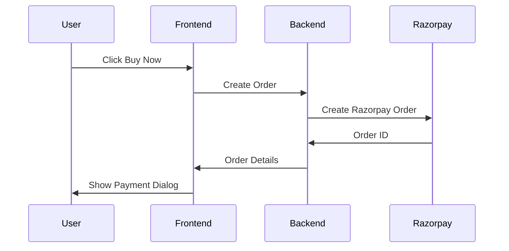
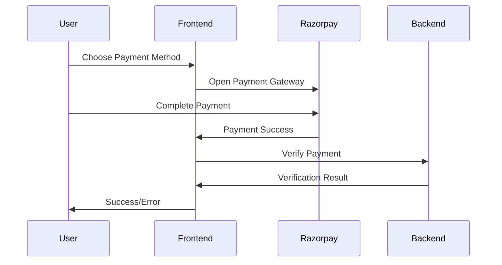
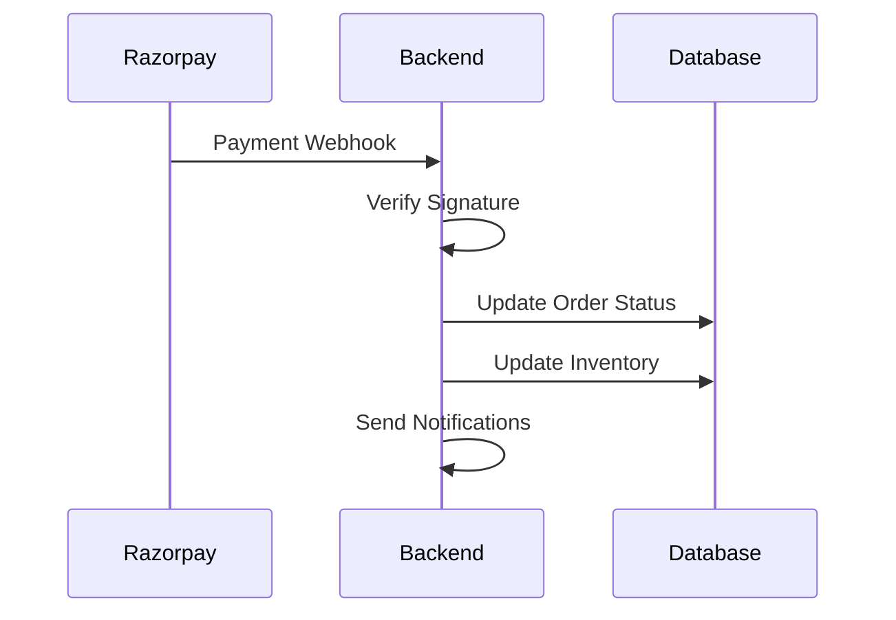

# Razorpay Payment Integration for MedChain Marketplace

This document provides a comprehensive guide for the Razorpay payment integration in the MedChain marketplace, allowing users to pay for medical supplies using various payment methods including cards, UPI, net banking, and digital wallets.

## 🎯 Features

- **Multiple Payment Methods**: Credit/Debit cards, UPI, Net Banking, Digital Wallets
- **Secure Processing**: SSL encryption and PCI compliance
- **Real-time Verification**: Payment signature verification
- **Webhook Support**: Automatic order status updates
- **Refund Processing**: Full and partial refunds
- **Dual Payment Options**: Choose between Razorpay and Blockchain payments

## 🏗️ Architecture

```
Frontend (React) → Razorpay Service → Razorpay API → Backend (FastAPI)
     ↓                    ↓                    ↓              ↓
Payment Dialog    Payment Processing    Order Creation   Database Update
```

## 📋 Prerequisites

1. **Razorpay Account**: Sign up at [razorpay.com](https://razorpay.com)
2. **API Keys**: Get your test and live API keys from Razorpay Dashboard
3. **Webhook URL**: Configure webhook endpoint for payment notifications

## 🔧 Setup Instructions

### 1. Environment Variables

Add the following environment variables to your `.env` file:

```env
# Razorpay Configuration
RAZORPAY_KEY_ID=rzp_test_YOUR_TEST_KEY
RAZORPAY_KEY_SECRET=YOUR_TEST_SECRET
RAZORPAY_WEBHOOK_SECRET=YOUR_WEBHOOK_SECRET

# For Production
# RAZORPAY_KEY_ID=rzp_live_YOUR_LIVE_KEY
# RAZORPAY_KEY_SECRET=YOUR_LIVE_SECRET
```

### 2. Install Dependencies

```bash
# Backend dependencies
cd backend
pip install -r requirements.txt

# Frontend dependencies (if needed)
cd ../src
npm install
```

### 3. Start Services

```bash
# Start the Razorpay API server
cd backend
python razorpay_api.py

# Start the main application
npm run dev
```

## 🚀 Usage

### Frontend Integration

The marketplace now includes a new `PaymentDialog` component that allows users to choose between Razorpay and Blockchain payments:

```tsx
import { PaymentDialog } from "@/components/marketplace/PaymentDialog";

// In your marketplace component
<PaymentDialog
  isOpen={isPaymentDialogOpen}
  onClose={() => setIsPaymentDialogOpen(false)}
  product={selectedProduct}
  quantity={purchaseQuantity}
  onBlockchainPayment={handleBlockchainPayment}
  userEmail="user@example.com"
  userPhone="+91-9876543210"
  userName="User Name"
/>
```

### Payment Flow

1. **User selects a product** and clicks "Buy Now"
2. **Payment dialog opens** with two payment options:
   - Razorpay (Default)
   - Blockchain
3. **User chooses payment method**:
   - **Razorpay**: Opens Razorpay checkout with multiple payment options
   - **Blockchain**: Processes payment through smart contract
4. **Payment processing** with real-time status updates
5. **Success/Error handling** with appropriate notifications

## 🔌 API Endpoints

### Backend API (Port 8002)

| Endpoint | Method | Description |
|----------|--------|-------------|
| `/health` | GET | Health check |
| `/api/razorpay/create-order` | POST | Create Razorpay order |
| `/api/razorpay/verify-payment` | POST | Verify payment signature |
| `/api/razorpay/payment/{id}` | GET | Get payment details |
| `/api/razorpay/refund` | POST | Process refund |
| `/api/razorpay/webhook` | POST | Handle webhooks |
| `/api/razorpay/config` | GET | Get frontend config |

### Frontend Service

The `razorpayService` provides the following methods:

```typescript
// Initialize Razorpay SDK
await razorpayService.initialize();

// Process payment
const payment = await razorpayService.processPayment({
  amount: 1000,
  currency: "INR",
  orderId: "order_123",
  description: "Medical supplies purchase",
  customerEmail: "user@example.com",
  // ... other options
});

// Verify payment
const isValid = await razorpayService.verifyPayment(
  paymentId,
  orderId,
  signature
);

// Get payment details
const details = await razorpayService.getPaymentDetails(paymentId);

// Process refund
const refunded = await razorpayService.refundPayment(paymentId, amount, reason);
```

## 💳 Payment Methods Supported

### Razorpay Payment Options

1. **Credit/Debit Cards**
   - Visa, MasterCard, American Express
   - RuPay cards
   - International cards

2. **UPI (Unified Payments Interface)**
   - All UPI apps (Google Pay, PhonePe, Paytm, etc.)
   - UPI ID payments
   - QR code scanning

3. **Net Banking**
   - All major Indian banks
   - Secure bank authentication

4. **Digital Wallets**
   - Paytm, PhonePe, Google Pay
   - Amazon Pay, FreeCharge
   - Other wallet apps

5. **Other Methods**
   - EMI options
   - Pay Later services
   - International payments

## 🔒 Security Features

### Payment Security

- **SSL Encryption**: All transactions are encrypted
- **PCI Compliance**: Razorpay is PCI DSS compliant
- **Signature Verification**: HMAC-SHA256 signature verification
- **Webhook Security**: Webhook signature validation

### Data Protection

- **No Card Storage**: Card details are never stored
- **Tokenization**: Sensitive data is tokenized
- **Audit Trail**: Complete transaction audit trail
- **Fraud Detection**: Built-in fraud detection systems

## 📊 Transaction Flow

### 1. Order Creation


### 2. Payment Processing


### 3. Webhook Processing


## 🧪 Testing

### Test Cards

Use these test cards for development:

| Card Type | Number | Expiry | CVV |
|-----------|--------|--------|-----|
| Visa | 4111 1111 1111 1111 | Any future date | Any 3 digits |
| MasterCard | 5555 5555 5555 4444 | Any future date | Any 3 digits |
| RuPay | 6073 8400 0000 0000 | Any future date | Any 3 digits |

### Test UPI

- **UPI ID**: `success@razorpay`
- **Any amount**: Will always succeed

### Test Net Banking

- **Bank**: Any test bank
- **Credentials**: Use any test credentials

## 🚨 Error Handling

### Common Errors

1. **Payment Failed**
   - Insufficient funds
   - Card declined
   - Network issues

2. **Verification Failed**
   - Invalid signature
   - Tampered data
   - Expired order

3. **Webhook Errors**
   - Invalid signature
   - Missing data
   - Processing failures

### Error Recovery

```typescript
try {
  const payment = await razorpayService.processPayment(options);
  // Handle success
} catch (error) {
  if (error.message.includes('cancelled')) {
    // User cancelled payment
  } else if (error.message.includes('failed')) {
    // Payment failed
  } else {
    // Other errors
  }
}
```

## 📈 Monitoring & Analytics

### Key Metrics

- **Success Rate**: Payment success percentage
- **Conversion Rate**: Cart to payment conversion
- **Average Order Value**: Average transaction amount
- **Payment Method Distribution**: Usage of different payment methods

### Logging

All payment events are logged for monitoring:

```python
logger.info(f"Payment initiated: {order_id}")
logger.info(f"Payment successful: {payment_id}")
logger.error(f"Payment failed: {error_message}")
```

## 🔄 Refund Processing

### Automatic Refunds

- **Failed Payments**: Automatically refunded
- **Cancelled Orders**: Full refund processing
- **Partial Refunds**: Support for partial amounts

### Manual Refunds

```typescript
// Process full refund
await razorpayService.refundPayment(paymentId);

// Process partial refund
await razorpayService.refundPayment(paymentId, 500, "Customer request");
```

## 🌐 Production Deployment

### 1. Environment Setup

```env
# Production environment variables
RAZORPAY_KEY_ID=rzp_live_YOUR_LIVE_KEY
RAZORPAY_KEY_SECRET=YOUR_LIVE_SECRET
RAZORPAY_WEBHOOK_SECRET=YOUR_WEBHOOK_SECRET
```

### 2. Webhook Configuration

Configure webhook URL in Razorpay Dashboard:
```
https://yourdomain.com/api/razorpay/webhook
```

### 3. SSL Certificate

Ensure SSL certificate is installed for secure transactions.

### 4. Monitoring

Set up monitoring for:
- Payment success rates
- Error rates
- Response times
- Webhook delivery

## 🛠️ Troubleshooting

### Common Issues

1. **Payment Gateway Not Loading**
   - Check internet connection
   - Verify Razorpay script loading
   - Check browser console for errors

2. **Payment Verification Failed**
   - Verify API keys
   - Check signature generation
   - Ensure correct order ID

3. **Webhook Not Receiving**
   - Verify webhook URL
   - Check server accessibility
   - Validate webhook secret

### Debug Mode

Enable debug logging:

```python
import logging
logging.basicConfig(level=logging.DEBUG)
```

## 📞 Support

### Razorpay Support

- **Documentation**: [docs.razorpay.com](https://docs.razorpay.com)
- **Support Portal**: [razorpay.com/support](https://razorpay.com/support)
- **API Reference**: [razorpay.com/docs/api](https://razorpay.com/docs/api)

### MedChain Support

For MedChain-specific issues:
- Check the logs in the backend
- Verify environment variables
- Test with sample data

## 🎉 Success!

Your MedChain marketplace now supports Razorpay payments! Users can:

- ✅ Pay using multiple payment methods
- ✅ Choose between Razorpay and Blockchain
- ✅ Enjoy secure, encrypted transactions
- ✅ Receive real-time payment confirmations
- ✅ Get automatic refunds for failed payments

The integration provides a seamless payment experience while maintaining the existing blockchain functionality for users who prefer cryptocurrency payments.


